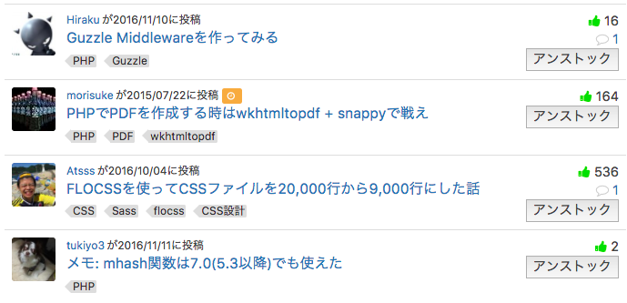

# Qiita Unstocker

個別ページに飛ばずに一覧からストック解除できる Chrome Extension

## インストール

1. [「Download ZIP」](https://github.com/mpyw/qiita-unstocker/archive/master.zip)で落としてきて展開
2. [chrome://extensions](chrome://extensions) を開く
3. 「デベロッパーモード」にチェックを入れる
4. 「パッケージ化されていない拡張機能を読み込む」で先ほど展開した **フォルダ** を選択  (`manifest.json`などのファイルが直下にくるフォルダ)

## スクリーンショット

